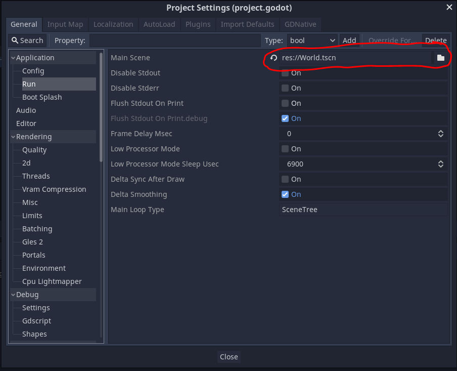

# Grid Based Movement Tutorial

**Playable Game: https://44351-w22.github.io/grid-based-movement-tutorial-cpotter019/**

## Assets and Attributions

They're squares, I made 'em

Tutorial based on the [Grid-based movement](https://kidscancode.org/godot_recipes/2d/grid_movement/) tutorial from Kids Can Code.

## What TODO

Open this game in the Godot Editor

Currently, there's a gridded tilemap and a player; our goal is to make the player move smoothly between the blue squares while not passing through the brown squares (which have collision).
They will act as a wall. 
Remember: collision doesn't mean solid surfaces; it just means that two areas are overlapping!

### Set up Player to Detect Walls

Open the player scene.
To the player add the following nodes:

* RayCast2D
* Tween

We will use the RayCast2D to determine if we are trying to move into a wall.
A Tween is a node related to the animation term "tweening", which is short for "inbetweening".
In animation, it means to generate intermediate frames between fixed points (remember when we made keyframes in our animations?).

We will need to set some things up to easily access everything in our script.

### Add a script to Player

First, we're going to set up some variables to make our lives a little easier.

We know that our tiles are 64x64 (or, if you don't know that, you do now).
We're also going to set up a structure that maps input events (we won't use custom ones, just the `ui_*` events) to directions

```python
# Player.gd
extends Area2D

const TILE_SIZE = 64
const INPUTS = {
	'ui_right': Vector2.RIGHT,
	'ui_left': Vector2.LEFT,
	'ui_up': Vector2.UP,
	'ui_down': Vector2.DOWN,
}
```

Let's also set up a constant for our speed and some handy variables to access the needed child nodes

```python
const SPEED = 3
onready var ray = $RayCast2D
onready var tween = $Tween
```

Now we're ready to rock and roll.

First, we need to determine the initial position of the player. 
The first row and column of our "board" is walls, so we know we want to move in to the upper left blue square.
We also want our player's center to be at the center of the tile.

The center position is relatively easy to calculate: we want the center of the player to be one and a half tiles from the top and left side of the screen.
We can calculate this with a nice little one-liner in `_ready()`:

```python
func _ready():
	position = Vector2.ONE * 3 * TILE_SIZE / 2
```

Run the game; make sure to set the world as the default scene to play (if you set Player as the main scene you can change it in the Project Settings).
It may already be set for you!



Make sure your player is in the middle of the upper most blue square.

### Getting Ready to Move

Before we start to handle inputs we're going to need to do two things:

1. Figure out where the next location we're trying to get to is
2. Check to see if it's a wall

If it's not a wall, then we will move our player.
We can use our ray object to determine if our target location is a wall.
We'll hide the movement code in a new function.

```python
func move(dir):
	ray.cast_to = INPUTS[dir] * TILE_SIZE
	ray.force_raycast_update()
	if !ray.is_colliding():
		move_tween(dir)
```

So... how does this magical `move_tween` method do it's thing?
Well, we'll ask our "inbetweener" to interpolate the positions between where we are and the target, and tell it to start updating the position:

```python
func move_tween(dir):
	tween.interpolate_property(self, "position", position,
		position + INPUTS[dir] * TILE_SIZE, 1.0/SPEED,
		Tween.TRANS_SINE, Tween.EASE_IN_OUT)
	tween.start()
```

### Handling inputs

Last but certainly not least, we need to work with our inputs.
Previously we worked with the handy `Input` manager, but we can do something a little more generic here.
Godot objects have a function that can be overridden called `_unhandled_input` that allows us to specify behavior for input events that haven't been handled yet.
We can set this function up to not do anything if we are currently animating our movement (handled by our `Tween`), or move us in the specified direction if we're not currently moving:

```python
func _unhandled_input(event):
	if tween.is_active(): # We are currently moving, do nothing
		return
	for dir in INPUTS.keys(): # Check to see if we're firing one of our inputs
		if event.is_action_pressed(dir):
			move(dir)
```

### Finishing (for evaluation)

Create a docs directory in the game's base folder. 
Export your game as HTML to `docs/index.html` (as we've done in class several times)
Enable GitHub Pages on your repository and push your game; make sure you can play your game online (you can check it by clicking the green checkmark after pushing and selecting the second "Details" option).
Submit the URL of your repo to the assignment for this tutorial.

